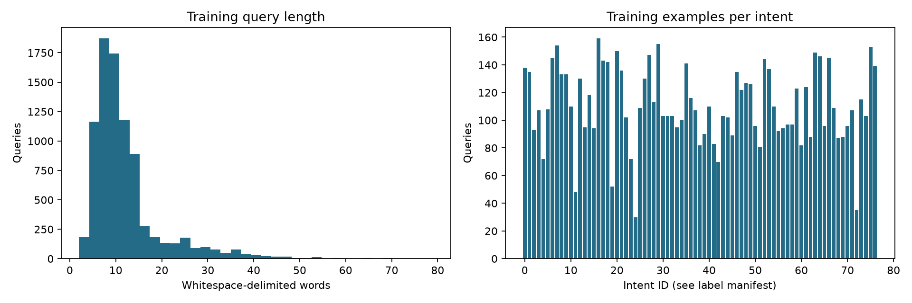
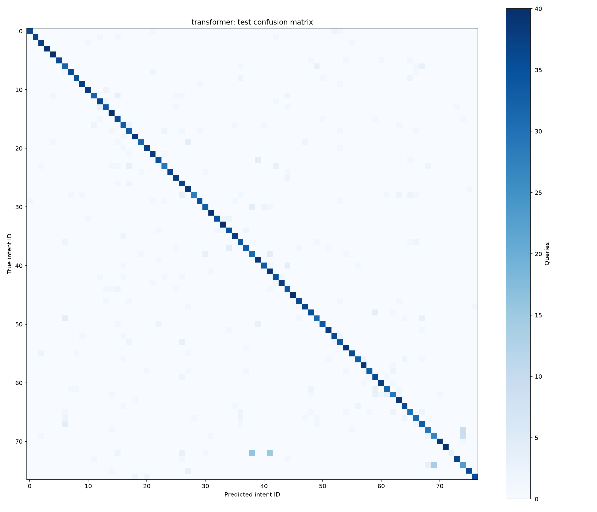

# Support Ticket Intelligence

Customer-service intent classification with a pretrained Hugging Face Transformer, a measured traditional NLP baseline, and reproducible local inference. An intermediate portfolio project connecting classical ML to NLP, deep learning and transfer learning.

## Business problem

Support teams need to identify why a customer is contacting them before routing a query. This project predicts one of 77 banking support intents from English text. It predicts intent, not urgency, business impact or a support team's identity.

## Solution

Normalize text, tokenize it with the pretrained WordPiece tokenizer, fine-tune BERT-Tiny using PyTorch, and return a category plus an uncalibrated confidence score. A TF-IDF/logistic-regression baseline provides a concrete comparison. Both models use identical data splits; only validation macro F1 selects the Transformer checkpoint.

## Architecture


## Dataset

[BANKING77](https://huggingface.co/datasets/PolyAI/banking77), published by PolyAI; Casanueva et al. (2020), *Efficient Intent Detection with Dual Sentence Encoders*. License: **CC BY 4.0**. The release contains **13,083 English customer-service queries and 77 intents**. Original `text` and `category` columns are downloaded from the publisher's CSV files and checked against published SHA-256 hashes.

The official test set contains 3,080 queries (40 per intent). After removing 11 duplicate/overlapping development rows, the project uses **8,493 training / 1,499 validation / 3,080 test** queries. No missing values were found. Training queries average about 12 words; the 96-token cap truncates 1 of 8,493 training examples. Full labels, supports and checksums: [split manifest](reports/split_manifest.json), [class distribution](reports/class_distribution.csv), [data documentation](data/README.md).



These are short banking utterances, not full helpdesk conversations. The benchmark has no priority labels. Exact deduplication cannot eliminate semantic overlap.

## Models

- **Baseline:** TF-IDF unigrams/bigrams, minimum document frequency 2, sublinear term frequency, logistic regression with C=4; no parameter search.
- **Main model:** [Google BERT-Tiny](https://huggingface.co/google/bert_uncased_L-2_H-128_A-2), Apache 2.0, two encoder layers and hidden size 128. The language encoder is pretrained; the 77-class head is newly initialized and all weights are fine-tuned. This small model fits practical CPU compute; DistilBERT is a possible future comparison.

Configuration: seed 42, 12 epochs, batch size 32, maximum 96 tokens, dynamic padding/attention masks, AdamW at 3e-4, weight decay 0.01, 10% warmup and linear learning-rate decay, gradient clipping 1.0. The best validation macro-F1 model and tokenizer are saved and reloaded for final test evaluation. The explicit PyTorch loop exposes forward pass, loss, backpropagation and optimizer updates without unnecessary training infrastructure.

## Results

<!-- RESULTS -->
| Model | Test accuracy | Macro F1 | Training seconds |
|---|---:|---:|---:|
| baseline | 88.31% | 0.8833 | 6.76 |
| transformer | 87.27% | 0.8693 | 352.14 |

<!-- END RESULTS -->

See [measured comparison and error analysis](reports/MODEL_COMPARISON.md) for precision, recall, weighted F1, class-level weaknesses, training cost and timing caveats. Full classification reports and confusion matrix CSVs retain every label. Matrix figures use numeric IDs from the split manifest to avoid 77 overlapping text labels.



Macro F1 weights every intent equally and exposes weak categories. Accuracy alone conceals which intents fail. The balanced test supports make weighted and macro averages equal here. This is a single-run benchmark with no uncertainty intervals.

Training supports range from 30 to 159 queries per intent after splitting. The run uses unweighted cross-entropy; class weighting or sampling could be evaluated later against validation macro F1.

## Example prediction

<!-- EXAMPLE -->
```json
{
  "text": "I was charged twice for the same card payment.",
  "predicted_category": "transaction_charged_twice",
  "confidence_score": 0.9489317536354065,
  "truncated": false
}
```
<!-- END EXAMPLE -->

All examples, including a deliberately out-of-domain printer request, are in [example_predictions.json](reports/example_predictions.json). There is no unknown-intent class: unrelated inputs still receive a banking label. Confidence is not a calibrated probability of correctness.

## Project structure

```text
support-ticket-intelligence/
  src/support_ticket/     # data, preprocessing, baseline, training, evaluation, inference
  notebooks/             # executed text EDA
  tests/                 # split hygiene, preprocessing, saved-model integration
  scripts/               # notebook execution, actual examples, report generation
  data/README.md         # provenance, license and split rules
  reports/               # measured metrics, predictions, figures and run metadata
  models/                # local artifacts, excluded from Git
  requirements-lock.txt  # exact environment used for the recorded run
  LEARNING_NOTES.md
  PROJECT_DECISIONS.md
  INTERVIEW_NOTES.md
  PROJECT_PROGRESS.md
```

## How to run

From this directory, using PowerShell (Python 3.11+; recorded environment is Python 3.14 on Windows):

```powershell
python -m venv .venv
.\.venv\Scripts\python.exe -m pip install -r requirements-lock.txt
.\.venv\Scripts\python.exe -m pip install -e .
.\.venv\Scripts\python.exe -m support_ticket.eda
.\.venv\Scripts\python.exe -m support_ticket.baseline
.\.venv\Scripts\python.exe -m support_ticket.train
.\.venv\Scripts\python.exe scripts\record_examples.py
.\.venv\Scripts\python.exe scripts\summarize_results.py
.\.venv\Scripts\python.exe -m support_ticket.inference "I was charged twice for the same card payment."
```

Initial setup requires internet access to public package, data and model hosts; no paid API or credentials are required. If reproducing on another OS/Python version, use `pip install -e .` to resolve compatible versions instead of the Windows run lock. Raw datasets and model weights are not committed; training recreates them. Saved-model inference is local and offline. Repeated predictions should reuse `TicketPredictor` to avoid loading weights every call:

```python
from support_ticket.inference import TicketPredictor
predictor = TicketPredictor()
result = predictor.predict_ticket("My new card has not arrived yet.")
```

`python -m support_ticket.train --epochs 1` provides a shorter experimental run but overwrites local Transformer artifacts; it does not reproduce the recorded 12-epoch results. Full reruns also replace reports; rerun the example/comparison scripts afterwards. No interrupted-training resume is implemented.

## Testing

```powershell
.\.venv\Scripts\python.exe -m pytest -q
.\.venv\Scripts\python.exe scripts\build_notebook.py
```

Tests cover text validation, preserved negation, stable labels, disjoint splits, conflicting duplicate removal, real tokenizer padding/masks/truncation, and deterministic saved-model prediction structure. The integration test skips explicitly if no trained artifact exists; train first to run it. Notebook execution reuses the same data/EDA code rather than duplicating preprocessing.

## Limitations and responsible use

This is a local portfolio workflow, not a deployed ticket service. It covers English banking, one intent per query, a small pretrained encoder and one training configuration. It has no unknown-category detector, calibrated confidence, review threshold, multi-intent handling or privacy filter. Long inputs can be truncated. Test performance does not establish production effectiveness.

Real customer messages may contain PII and account details. Minimize collection and retention, redact before logging, and control access before introducing real traffic. Misclassification can misroute requests; thresholds and human review should be validated against operational error costs. Dataset bias, new categories and changing customer language require monitoring and retraining. Do not automatically act on sensitive account requests based on this prediction.

## Potential production extensions

Future work could add a FastAPI classification service, Docker packaging, ticket-platform integration, validated queue mappings, calibrated abstention/human review, feedback collection and monitoring of drift and per-class errors. A real flow would connect ticket submission → classification service → routing rules → support queue. Measure end-to-end latency, privacy controls and routing quality before deployment. These integrations are not implemented.

## Study notes

[Learning notes](LEARNING_NOTES.md) explain project-specific concepts; [decisions](PROJECT_DECISIONS.md) capture choices and trade-offs; [interview notes](INTERVIEW_NOTES.md) retain concise talking points; [progress](PROJECT_PROGRESS.md) records actual completion.

## Publish to GitHub

Create an empty `support-ticket-intelligence` repository under your GitHub account, then run the following from PowerShell. This directory is a separate project inside the existing workspace; use its own repository rather than adding it to the insurance repository.

```powershell
cd "C:\Users\ldm31\OneDrive\Desktop\Project\insurance-cost-prediction\support-ticket-intelligence"
git init -b main
git add .
git commit -m "Build support ticket NLP and Transformer classification pipeline"
git remote add origin https://github.com/ldm3106/support-ticket-intelligence.git
git push -u origin main
```

Data, cached dependencies and model weights are excluded by `.gitignore`. The executed notebook, measured reports, source and documentation are included.
